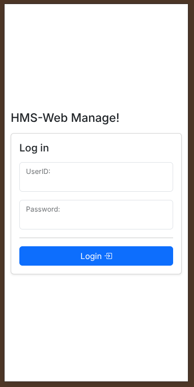
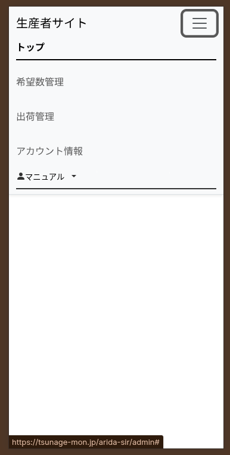

# ログインとメニュー画面

システムの入り口となるログイン画面と、全体の操作を選ぶメニュー画面の見方をご説明します。

---

## ログイン画面
システムを利用するために、まずはご自身のアカウントでログインします。

1. システムのURLにアクセスすると、上記のログイン画面が表示されます。
2. 市役所から案内された **ID（メールアドレス等）** と **パスワード** を入力します。
3. **「ログイン」** ボタンを押すと、システムの中に入ることができます。

> [!TIP]
> パスワードを忘れてしまった場合は、市役所担当窓口までご連絡いただきパスワードの再発行をご依頼ください。

---

## メニュー画面
ログインが成功すると、最初に操作を選ぶメニュー画面が表示されます。

ここでは、あなたが行いたい業務（ふるさと納税の希望申込や、出荷データの確認など）をタップして選びます。

1. **希望申込:** 次回のふるさと納税の出荷可能数を市役所に伝えるための機能です。
2. **申込サマリー / 申込履歴:** 過去に行った希望申込の内容を確認できます。
3. **出荷サマリー / 出荷指示:** 今日出荷すべき商品や、送付先のデータを確認できます。
4. **アカウント情報:** ご自身の登録情報（名前やパスワードなど）を確認・変更できます。
