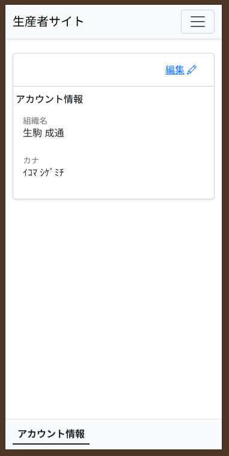
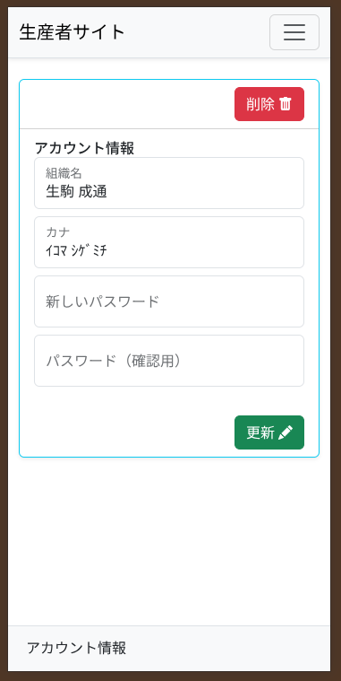

# アカウント情報の確認と変更

システムに登録されているご自身の名前や連絡先、パスワードを確認・変更するための機能です。

---

## アカウント情報の確認
メニューから「アカウント情報」をタップすると、現在の登録内容を確認できます。

1. ご自身の**お名前**や**メールアドレス**が正しく登録されているか確認できます。
2. 内容を変更したい場合や、パスワードを変更したい場合は、画面下の **「編集」** ボタンをタップします。

---

## アカウントの編集（パスワード変更など）
「編集」ボタンを押すと、登録情報を書き換えることができます。

1. 変更したい項目（名前など）をタップして、新しい内容を入力します。
2. **パスワードを変更したい場合**は、「新しいパスワード」の欄に入力してください。（変更しない場合は空欄のままで構いません）
3. 最後に **「保存」** または **「更新」** のボタンを押すと、内容がシステムに反映されます。

> [!WARNING]
> パスワードを変更した場合は、次回のログイン時から新しいパスワードが必要になります。忘れないようにご注意ください。
