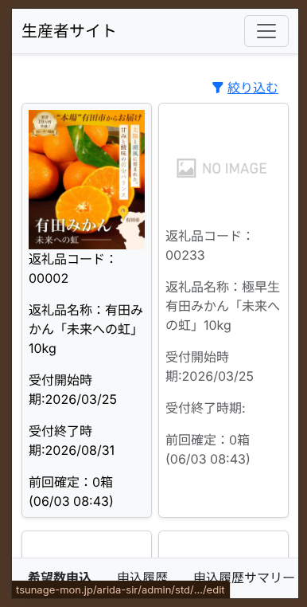

# 希望申込のやり方

次回のふるさと納税において、「自分がどれくらいの量を出荷できるか」を市役所に伝える（申し込む）ための機能です。

---

## 希望申込画面
メニューから「希望申込」をタップすると、以下の画面が表示されます。

ここでは、あなたが出荷できる商品（品目）の一覧が表示されます。

1. **数量の入力:** 出荷できる商品の横にある入力欄に、**提供可能な数量**を半角数字で入力します。
2. もし出荷できない商品がある場合は、「0」のままにしておいてください。
3. 全ての数量を入力し終えたら、画面下部の **「申込」** ボタンをタップします。

> [!NOTE]
> ここで入力した数量をもとに、市役所側で割り振りの計算が行われます。無理のない範囲で正確な数をご申告ください。
