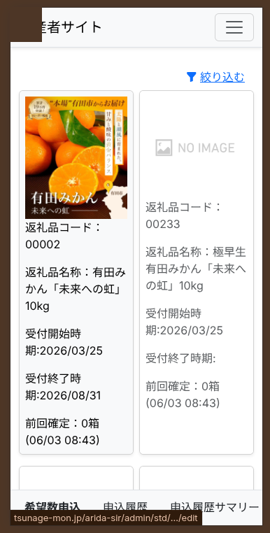
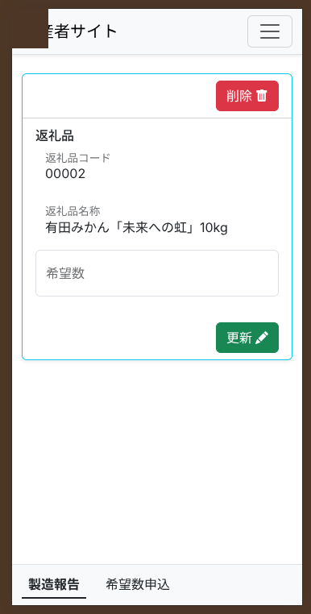
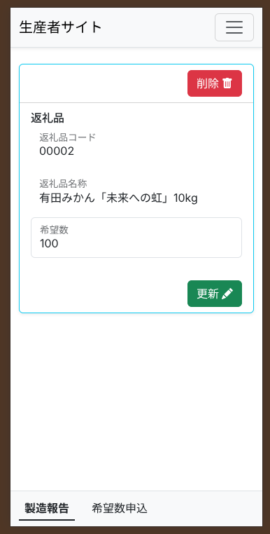

# 希望申込のやり方

次回のふるさと納税において、「自分がどれくらいの量を出荷できるか」を市役所に伝える（申し込む）ための機能です。

---

## 申込データの一覧
まずは申込みを行うデータの一覧を確認します。

*(※一覧画面の表示例)*

1. メニューから「希望申込」をタップします。
2. あなたが出荷できる商品（品目）や、これから入力すべきデータの一覧が表示されます。
3. 新しく数値を入力したいデータ（または修正したいデータ）をタップして開きます。
   *(※一覧画面でそのまま数値入力できる場合は、直接入力して進めてください)*

---

## 数量の入力・送信
入力画面で、提供可能な数量を入力します。

1. **数量の入力:** 出荷できる数量を半角数字で入力します。もし出荷できない商品がある場合は、「0」のままにしておいてください。
2. 入力した内容に間違いがないか、もう一度確認してください。
3. 最後に **「申込」**（または「保存」）ボタンをタップすると、市役所へデータが送信されます。

> [!NOTE]
> ここで入力した数量をもとに、市役所側で割り振りの計算が行われます。無理のない範囲で正確な数をご申告ください。
