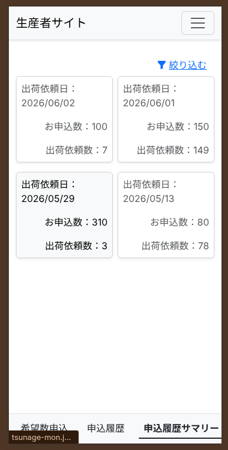
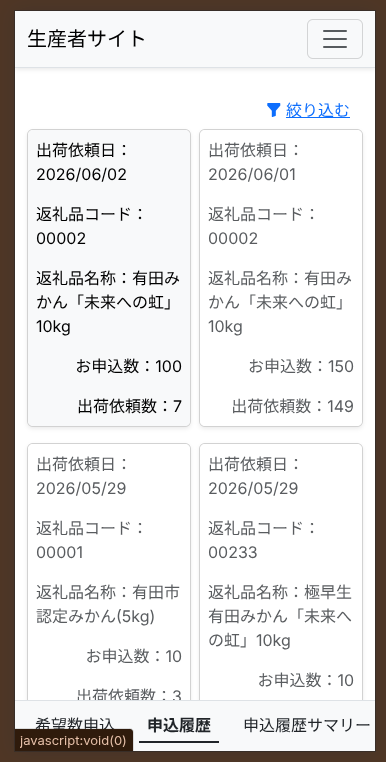

# 申込状況・履歴の確認

過去にあなたが送信した「希望申込」の内容や、その集計結果（サマリー）を確認するための機能です。

---

## 申込サマリー
自分がどれくらいの量を申し込み、合計でどれくらいになっているかをひと目で確認できます。

1. メニューから「申込サマリー」をタップします。
2. 品目（商品）ごとに、これまでに申し込んだ総数などが一覧で表示されます。
3. 「あれ？どれくらい申し込んだっけ？」と確認したい場合に便利です。

---

## 申込履歴
いつ、どの商品を、何個申し込んだか、という「過去の記録」を1件ずつ順番に確認できます。

1. メニューから「申込履歴」をタップします。
2. 過去の申込データが、新しい順（または古い順）にリストで表示されます。
3. 詳細を確認したい履歴をタップすると、その時に申し込んだ数量の内訳などを見ることができます。
