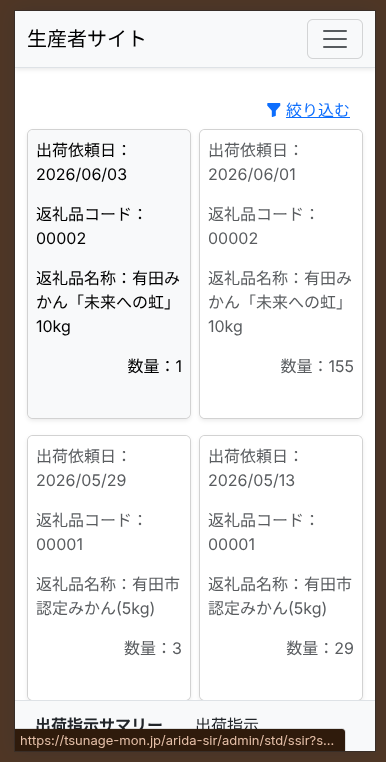
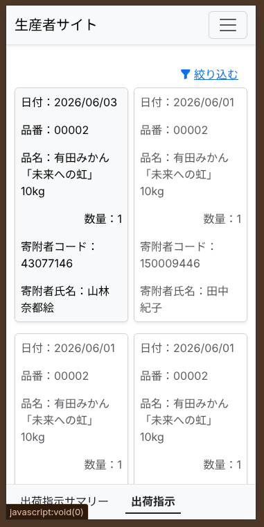

# 出荷サマリーと指示の確認

「今日（または明日）どれくらいの商品を、どこへ出荷すればいいか」を確認するための機能です。

---

## 出荷サマリー
その日に出荷するべき商品の**全体量（合計数）**をパッと確認できます。

1. メニューから「出荷サマリー」をタップします。
2. 「どの商品が」「合計で何件」出荷予定かが表示されます。
3. 出荷作業の朝一番に確認し、段ボールや商品の準備をする際に役立ててください。

---

## 出荷指示
合計数ではなく、**「誰（どこ）宛に送るか」という1件ずつの詳細な指示データ**を確認できます。

1. メニューから「出荷指示」をタップします。
2. 出荷先ごとのリストが表示されます。
3. リストをタップすると、送付先の詳しい住所や、同梱すべき商品の詳細を見ることができます。
4. この指示に従って、荷造りと送り状の貼り付けを行ってください。
