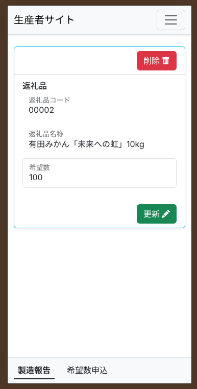

# 製造報告の入力

加工品など、製造が完了した商品の数や状態を市役所へ報告するための機能です。

---

## 製造報告の一覧
まずは報告すべき製造データの一覧を確認します。

1. メニューから「製造報告」をタップします。
2. 過去の報告履歴や、これから報告すべきデータが一覧で表示されます。
3. 新しく報告を入力したいデータ（または修正したいデータ）をタップして開きます。

---

## 報告の入力・送信
選んだデータの詳細画面で、実際の製造実績を入力します。

1. **実績の入力:** 実際に完成した商品の数（製造実績）などを入力します。
2. 入力した内容に間違いがないか、もう一度確認してください。
3. 最後に **「保存」**（または「送信」）ボタンをタップすると、市役所へデータが報告されます。

> [!TIP]
> もし送信した後に間違いに気づいた場合は、速やかに市役所の担当窓口までご連絡ください。
